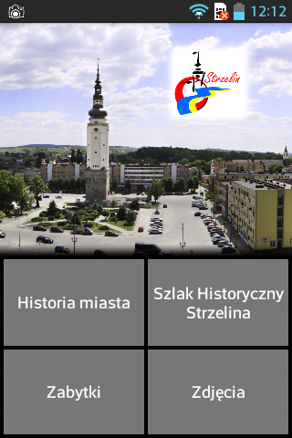
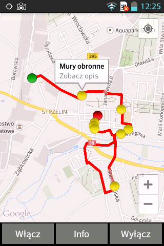
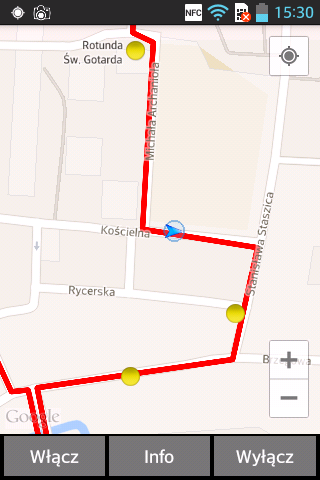
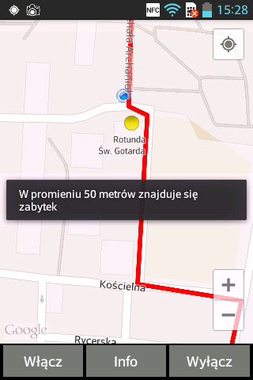
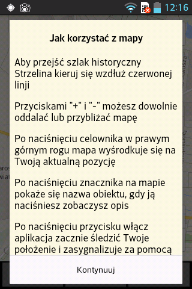
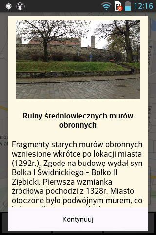
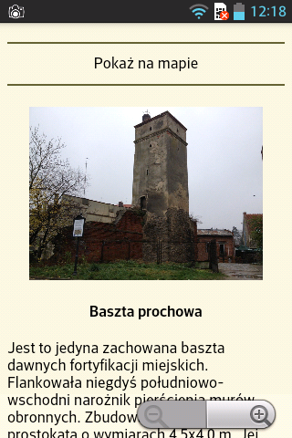
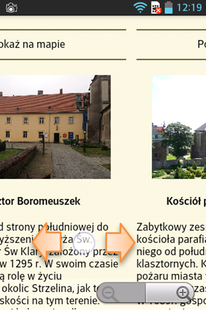

<h1 align="center"> Strzelin - Android app </h1>

  This is an application that is a replacement for the traditional tourist guide around Strzelin historical track.

 
## Table of contents
* [General info](#general-info)
* [Screenshots](#screenshots)
* [Setup](#setup)
* [Features](#features)
* [Status](#status)
* [Inspiration](#inspiration)
* [Contact](#contact)

## General info
App is designed for mobile devices based on Android operation system.
It allows for constant monitoring user position to follow along the designated route (Strzelin historical track) so it reduces the risk of getting lost. User can also read about Strzelin's history, view some pictures and description of Strzelin's importnant historical places.  
App is based on paper info-card about Strzelin historical track and extended with informations about Strzelin history from  Stanisław Strauss's book "Strzelin i Wzgórza Strzelińskie"

## Screenshots

 |
 |
 |

 |
 |
 |
 

## Setup
To open project:  
Clone this repository and import into Android Studio

To open app on Android system:  
Install Strzelin.apk file on Your device with Android 4.4 or newer

## Features

* Description of the city's history
* Description of the most importnant Strzelin's historical places
* Album of historical photos from Strzelin
* Map with Strzelin historical track (based on Google Maps)
* Navigation through Strzelin historical track
* Monitoring user position (can be turned ON or OFF depends on user preferences) with sound and visual notifications when user is getting close to some historical importnant place

## Status
What You can see now is a first version of Strzelin app from 2014. Created in Eclipse, uploaded without any changes except commented out google-play-services_lib reference from project.properties just to make importing project to Android Studio possible.  
Now I am working on updating this app to a newest programing standards. At this point there are some difficulties to compile mostly because of obsoleted methods and libraries which were used in 2014. Howewer .apk file created using old version of "Eclipse" is now working correctly on devices with actual version of android.

## Inspiration
I created this app back in 2014 to let people who are visiting Strzelin to experience Strzelin historical track in more modern way (using their smartphones or tablets). At that time there was only one official paper version of Tourist guide through Strzelin historical track.

## Contact
marcinklysz@gmail.com
